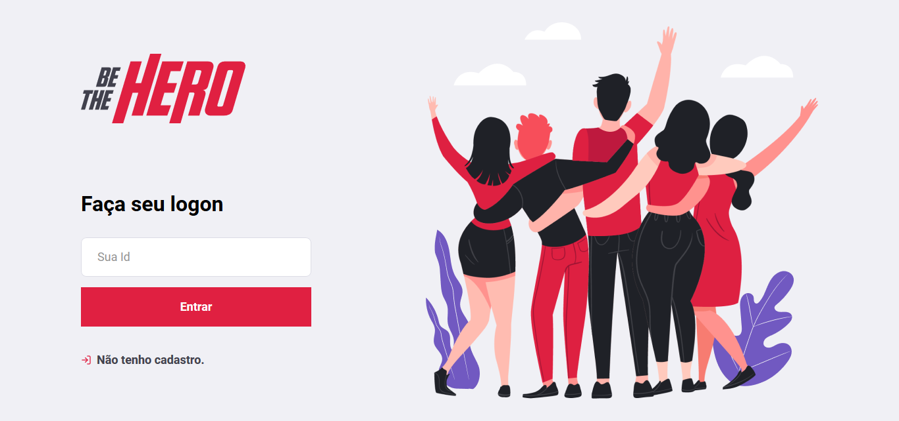

# Be The Hero
### Project developed at Omnistack Week 11

# Technologies
This project was developed with the following technologies:
* [Node.js](https://nodejs.org/)
* [React](https://reactjs.org/)
* [React Native](https://reactnative.dev/)

# Web Layout 
### Home Page

### Register Page

# Mobile Layout
